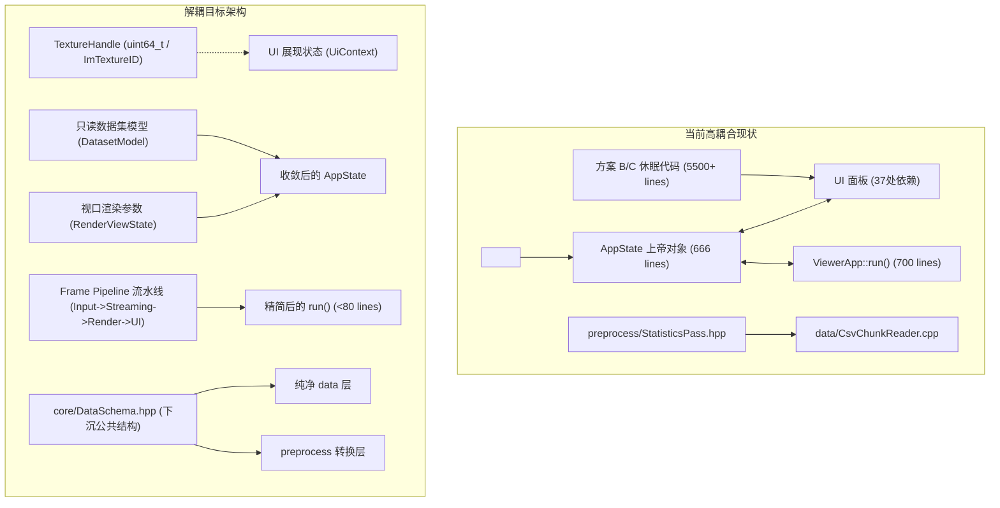

# GeoScatter3D 规则中间产物：系统工程规范与 CppStudio 治理标准

> 本文档为 GeoScatter3D 项目在接入 `cpp-cuda-vulkan-studio` 治理体系后的**核心规则与中间产物规范**（Rules Intermediate Artifact）。
> 本规范统摄所有参与本项目的智能体与开发人员，定义不可违背红线、架构解耦标准、过程状态机及技术叠加层契约。

---

## 一、CppStudio 过程治理状态机（Process State Machine）

本项目遵循 `cpp-cuda-vulkan-studio` 的渐进式治理模型（Progressive Enforcement）。日常开发中保持工程判断力，不随意堆叠流程，根据任务性质确定唯一活动状态：

### 1. 状态分类与准入
1. **Standard（标准状态）**：
   - **适用**：边界明确、风险已知、影响局部的单一功能新增、缺陷修复或小范围重构。
   - **准则**：单一假设、单次变更、运行规范测试验证后闭环交付。
2. **Investigative（调查状态）**：
   - **适用**：所有权不清晰、架构耦合深、API 行为不确定、性能瓶颈定位、或单一假设验证失败。
   - **准则**：禁止盲目修补代码；必须通过 MCP 图谱、针对性单测、控制面日志或探针搜集确切证据，形成因果链后再制定变更。
3. **Governed（治理状态）**：
   - **适用**：跨子系统架构重构（如 `AppState` 拆解、`run()` 管道化、方案 B/C 废弃代码归档）、多组件联动、接口契约破坏性升级。
   - **准则**：建立显式变更清单与回滚预案，分阶段推进并维持工程护栏（CI 行数预算）。
4. **Recovery（恢复状态）**：
   - **适用**：多次修复循环失败、补丁堆叠、证据矛盾、破坏基本红线。
   - **准则**：立即停止功能迭代，回退到已知稳定提交，排查根因后重新分类。

### 2. 状态转移记录规范
状态转移时在说明中显式记录单行转移标记：
```text
CppStudio state: <Standard|Investigative|Governed|Recovery>; reason=<依据>; evidence=<命令/文件/日志>; exit=<退出条件>
```

---

## 二、不可逾越的工程红线清单（Repository Redlines）

以下 12 条红线由项目历史事故与关键设计裁决沉淀而成，任何提交必须 100% 遵守：

| 编号 | 核心红线 | 详细要求与历史背景 |
| :--- | :--- | :--- |
| **#1** | **自动化驱动退出规范** | 自动化驱动必须带 `--no-welcome` 启动，必须通过控制面 `quit` 正常退出；退出后必须验证 `GeoScatter3D.exe` 进程已完全销毁，严禁残留僵尸进程（背景：TIA-150 曾堆叠 7 个卡在欢迎界面的后台进程锁死显存）。 |
| **#2** | **严禁操作系统级桌面截屏** | 自动化验证取图**唯一合法途径**是控制面 `screenshot` 命令（通过 Vulkan swapchain 全幅回读客户区）；**严禁**使用 BitBlt、PrintWindow、OS 级截屏工具或抢夺前台焦点；自动化必须全流程带 `--headless` 运行（背景：TIA-151 截屏曾闯入用户工作桌面）。 |
| **#3** | **UI 缩放与 Vulkan 链解耦** | `ui_scale_multiplier` 仅作用于 ImGui 字体与控件尺寸（`ScaleAllSizes`），**严禁**流入 Vulkan 离屏 Framebuffer、Swapchain、管线视口和拾取回读的像素尺寸计算链。 |
| **#4** | **GPU Pick 单次运行稳定性** | 渲染输出写出的 `point_id`（1-based）仅保证**在当前单次进程生命周期内稳定**，严禁将其作为持久化 ID 写入文件、工程快照或跨进程引用。 |
| **#5** | **格式版本强校验** | 强制采用显式小端 IEEE-754 GS3D v2 格式；LOD v1 已经全面废弃，读取端遇 v1 必须显式报错拒绝；Tile 读取端必须按数据头声明的 `point_stride` 逐块强校验，严禁静默容忍 stride 不匹配或空洞数据。 |
| **#6** | **废弃配置严禁死灰复燃** | `max_visible_tiles` 与 `auto_save_sidecar` 已被永久废弃；禁止在配置、代码中重新引入无消费者消费的配置参数。 |
| **#7** | **代码为唯一真实信源** | 当文档与代码出现冲突时，以当前可运行、可测试的代码为唯一事实标准；确认代码行为后必须同步修正文档，禁止保留虚假或过时的设计记录。 |
| **#8** | **立即模式 UI 心智模型** | UI 每帧从零构建，严禁在 UI 回调中保存控件指针或持久对象；耗时计算禁止放在 ImGui 绘制循环内；所有业务状态必须由外部模型持有。 |
| **#9** | **ImGui ID 栈与配对严谨性** | 循环与动态列表中必须使用 `PushID`/`PopID` 或带 `##` 唯一标识；`Begin` 返回 false 时仍须调用 `End()`；而 `BeginChild` / `BeginTable` / `BeginPopup` 返回 false 时严禁调用对应 `End`。 |
| **#10** | **数据层依赖单向性** | `data` 模块是基础文件格式与内存数据抽象层，**绝对禁止**反向 `#include "preprocess/..."`；公共统计结构必须统一下沉到 `data` 或 `core`。 |
| **#11** | **图形句柄不穿透到业务与 UI** | `AppState.hpp` 及各 UI 面板头文件**禁止直接包含 `<vulkan/vulkan.h>`**；纹理对象在 UI 层一律以不透明类型（`ImTextureID` 或 `uint64_t`）传递。 |
| **#12** | **工程护栏与行数预算** | `scripts/check_engineering_guardrails.py` 设定的单文件行数预算（`ViewerApp.cpp: 912`, `ViewerApp::run(): 716`, `UiRoot.cpp: 1207`, `AppConfig.cpp: 763`）是硬性上限；重构与新增代码只允许下降，严禁超标。 |

---

## 三、架构解耦关键任务规范（Decoupling Architecture Specifications）

针对当前系统内部的 5 大耦合点，制定以下解耦演进契约：



### 1. `AppState` 上帝对象拆解契约
- **现状**：混杂业务数据、渲染配置、瓦片流式进度、控件动效计时器与 Vulkan 句柄。
- **解耦动作**：
  1. 将 3 个 `VkDescriptorSet` 替换为不透明别名 `using TextureHandle = std::uint64_t;`，从 `include/app/AppState.hpp` 中移除 `#include <vulkan/vulkan.h>`；
  2. 提取 `DatasetSummary`（点数、边界、字段通道）；
  3. 将抽屉、卡片动效等瞬态 UI 变量从 `AppState` 下放至对应 UI 局部上下文，避免任何 UI 样式调整导致全工程重新编译。

### 2. 休眠代码（方案 B & C）归档隔离
- **现状**：`FloatingDockUi.cpp`（3633 行）与 `AnalysisRailUi.cpp`（1878 行）已被 TIA-111 旁路，但仍强挂在构建目标中。
- **解耦动作**：
  1. 彻底断开 `UiRoot` 对两套备选布局的调用；
  2. 将两套布局代码移入 `experimental/` 或打标签历史归档，从 `gs3d_app` 编译依赖中移除；
  3. 清理 `AppState` 中的 `AnalysisRailUiState` 与 `DockUiState`。

### 3. 主循环流水线化（Frame Pipeline）
- **现状**：`ViewerApp::run()` 单函数 689 行处理 7 项异构职责。
- **解耦动作**：
  1. 定义 `IFrameStage` 或显式流水线分步：
     - `Stage 1: ProcessInputAndControlPlane()`
     - `Stage 2: UpdateCamerasAndSync()`
     - `Stage 3: DispatchTileStreaming()`
     - `Stage 4: RenderOffscreenViewports()`
     - `Stage 5: RenderImGuiAndCollectActions()`
     - `Stage 6: PresentFrame()`
  2. `ViewerApp::run()` 只保留主循环控制流与错误守卫，单函数控制在 80 行以内。

### 4. 数据层反向包含清理
- **现状**：`src/data/CsvChunkReader.cpp` 包含 `preprocess/StatisticsPass.hpp`。
- **解耦动作**：
  - 将字段统计指标（min/max/valid_count 等）定义下沉到 `include/core/DataSchema.hpp`，解除 `data` 对 `preprocess` 的依赖，使 `scripts/check_include_deps.py` 严格成立且无需增加例外。

---

## 四、Technical Overlays 技术叠加层执行标准

在开发特定模块时，激活对应的技术叠加层规程：

### 1. Vulkan Compute & Render Sync Overlay
- 保持严格的生命周期顺序：`VulkanContext` 晚于所有缓冲区与描述符释放；`ImGuiLayer` 在 `ViewportManager` 销毁后再关闭。
- 严禁隐式同步；对设备级等待（`vkDeviceWaitIdle`）保持零容忍，多视口 resize 必须采用防抖合并；
- 修改着色器或 push constant 布局时，必须同步核验 `PointPipeline` 的字节对齐（16 字节对齐）。

### 2. Native C++ GUI & HUD Overlay
- 遵循碳蓝工作台 2.0 规范，主题由 `include/ui/Theme.hpp` 集中调度；
- 所有 UI 产生的作用力只能通过 `UiActions` 数据结构向外返回，严禁 UI 内部直接向 Vulkan、文件系统或工作线程发起副作用请求。

### 3. Agentic Control Harness Overlay
- 控制面使用统一 JSON-RPC 2.0 协议（TCP 端口默认 9871）；
- 测试用例必须具备自动释放端口、自动关闭连接并验证进程退出的能力；
- 截图自动化测试必须调用控制面 `screenshot` 并校验返回图像尺寸与非黑屏特征。

### 4. Viewport & Camera Interaction Overlay
- 默认轨道旋转枢轴（Orbit Pivot）以数据点云几何中心（Data bounds center）为基准；点选有效点后自动切换为该选定点，平移时不改变选定枢轴的世界绝对位置；
- 框选反投影计算必须经过视口坐标正投影检验，确保缩放与平移后对焦准确。

---

## 五、验收与交付标准（Acceptance Gates）

每次迭代交付前，必须通过以下 4 项门禁验证：
1. **静态检查门禁**：
   - 包含依赖检查：`python scripts/check_include_deps.py`（无新增非法包含）。
   - 工程护栏检查：`python scripts/check_engineering_guardrails.py`（行数预算零超标）。
2. **单元测试门禁**：
   - `ctest --test-dir tmp/build-win -C Release --output-on-failure`（37 个测试集、数百个 assertion 100% 通过）。
3. **进程安全门禁**：
   - 执行 `Get-Process -Name GeoScatter3D`，确认无后台残余进程。
4. **交付说明格式**：
   - 遵循三行以内极简交付格式：改了什么、为什么、关键风险点。
