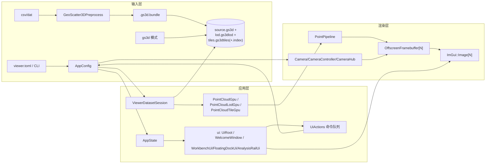

# GeoScatter3D 架构与现状

> 状态: 现行 | 核对基准: 2026-08-14, main@1f0eb84 + TIA-90/TIA-93 修复

## 架构总览



组件分层: `platform` (GLFW 窗口) → `gui`/`ui` (ImGui 生命周期与面板) →
`app` (配置/状态/编排) → `render` (Vulkan 资源与绘制) / `camera`
(相机数学与同步) / `data`+`preprocess` (格式与转换)。
UI 只产出命令 (`UiActions`), 状态由 `AppState` 持有, 主循环消费。

## 数据流

```text
viewer.toml / CLI
        |
        v
AppConfigLoader
        |
        +-- input=csv|dat --> Statistics/CsvChunkReader --> Gs3dWriter
        |                                          \----> Gs3dTileWriter
        |
        +-- input=bundle --> PreprocessedBundle (manifest.toml 解析)
        |
        v
Gs3dDataset metadata/full points + optional LOD/tile sidecars
        |
        v
PointCloudGpu / PointCloudLodGpu / PointCloudTileGpu
        |
        v
PointPipeline --> OffscreenFramebuffer[N] --> ImGui::Image[N]
```

## 主要模块

| Module | Interface | Implementation 与职责 |
|---|---|---|
| `app` | `AppConfig`, `AppState`, `UiActions`, `ViewerApp` | 解析配置、保存 UI 状态、编排生命周期、resize 防抖和 tile LRU 缓存 |
| `data` | CSV 与 GS3D/LOD/tile reader/format | 文件格式校验、索引查询、点数据读取 |
| `preprocess` | converter/writer | 并行统计、CSV 转换、LOD 和 tile 生成 |
| `render` | Vulkan context/buffer/pipeline/cloud/viewport | Vulkan 资源所有权与命令录制 |
| `camera` | `Camera`, `CameraInput`, `CameraController`, `CameraHub` | 相机数学、视图局部输入映射和可选同步组传播 |
| `gui`/`ui` | `ImGuiLayer`, `UiRoot` | ImGui 生命周期、Adobe 风格 docking 布局和 UI 命令生成 |
| `platform` | `Window` | GLFW 初始化、主窗口和键盘/事件处理 |

## 启动流程

1. `main()` 读取 TOML 和命令行覆盖项。
2. CSV/DAT 模式先生成 GS3D；启用 tile 时同时生成 tile index/data；bundle
   模式按 manifest 解析已有产物。
3. LOD sidecar 可用时只加载 GS3D header；需要构建 LOD 或全量渲染时才加载点数组。
4. 创建窗口、Vulkan context、swapchain、renderer 和 ImGui。
5. 预分配最多 4 个独立离屏视口，默认显示配置指定的 1 个视图，并创建点渲染
   管线、相机控制器和 GPU 点云。
6. 进入逐帧循环。

## 逐帧流程

1. 轮询窗口事件并更新帧率。
2. 从真实运行状态生成 `AppState`，由 `UiRoot` 返回包含各视图输入快照的
   `UiActions`。
3. `CameraController` 使用 ImGui 视图画布上的局部输入更新目标相机；相机默认独立，
   只有勾选“联动相机”的视图才由 `CameraHub` 传播变化。
4. 相机稳定后触发 tile 选择；后台 future 完成后按
   `tile.gpu_upload_budget_bytes` 分帧批量上传 GPU。
5. 在 swapchain render pass 前仅渲染激活标签页和实际可见的独立平台窗口。
6. 每个视图由独立 ImGui 窗口采样，可作为中央标签页或拖成跨屏平台窗口；输入不再
   依赖 GLFW 主窗口鼠标坐标。
7. resize 请求稳定 150 ms 后批量处理，一批只执行一次 GPU 空闲同步。

## GPU Pick Contract

- 生产 hover 与 box-select anchor 现在走 GPU pick，而不是 CPU
  `NearestPointQuery`。
- 每个渲染点会写出一个 `point_id` 到离屏 pick attachment。这个
  `point_id` 只保证**单次运行内稳定**，用于本次进程中的 hover/框选反查；
  它不是跨运行、跨文件的持久 ID，不能拿去做选中结果存盘或长期引用。
- pick 规则是**纯 front-most**：围绕光标回读 `5 x 5` 邻域，只看命中的像素，
  在这些像素里选择深度最小的那个点。
- 这个规则不会先按屏幕距离挑像素，所以当前后点在邻域内并排出现时，会优先选中
  更靠前的已渲染点，而不是更靠后的“屏幕更近像素”。
- `NearestPointQuery` 仍保留，语义依旧是“屏幕空间 2D 最近且带阈值”；它现在主要
  用于历史测试/对照，不再代表生产 hover 契约。

## 已完成的性能优化

- 3302 万点样例在 LOD sidecar 模式下，GS3D 读取由约 `0.57 s` 降至
  `0.00003 s`，并避免约 `504 MiB` 完整点数组常驻。
- tile CPU 缓存受 `tile.cpu_cache_max_bytes` 限制，使用 LRU 淘汰并显示真实命中率。
- tile future 直接持有本次上传数据，缓存淘汰不会破坏正在进行的 GPU 上传。
- tile GPU buffer 先批量准备，再在一个命令缓冲中复制；上传按帧预算切片，避免每个
  tile 单独 `vkQueueWaitIdle` 和一次性百毫秒级主线程停顿。
- 交互期间暂停高分辨率 tile 上传并使用最低 LOD；相机稳定后再恢复 tile 选择和
  渐进上传。
- 视口 resize 从“每次尺寸变化执行一次 `vkDeviceWaitIdle`”改为防抖后批量重建。
- 隐藏视图和未激活标签页不再执行离屏点云渲染。
- 各视图保留自己的 tile 选择集合；移动一个独立窗口不会清空其他视图的高分辨率
  结果。
- 多视图状态一次分配后原地更新，移除了逐帧 clear/push 和颜色选项临时数组。
- LOD 只在相机真正移动或缩放时进入交互态，消除了静止状态的层级抖动。

在 3302 万点样例和同一台测试机器上，旧版默认 4 视图高 LOD 空闲时 GPU 持续
100%；默认单视图后约为 35%-38%。高分辨率 tile 已驻留时，连续拖动由 100%
降至约 40%-51%。一次约 234 MiB、110 ms 的集中上传被拆为受 8 MiB 预算约束的
多帧切片，除首片外多数约 3-5 ms。以上数字用于说明本机前后差异，不是跨设备指标。

## 资源所有权

- `VulkanContext` 比所有 Vulkan 子资源活得更久。
- `VulkanRenderer` 拥有 swapchain framebuffer、同步对象和命令缓冲。
- `ViewportManager` 拥有每个视口的 `Camera + OffscreenFramebuffer`。
- `OffscreenFramebuffer` 拥有颜色图、深度图、render pass、framebuffer 和
  ImGui texture descriptor。
- `PointCloud*Gpu` 拥有点数据对应的 Vulkan buffer。
- `ImGuiLayer` 在 `ViewportManager` 之后析构，保证 descriptor 先注销、ImGui
  backend 后关闭。

## 当前功能状态

以下清单对应 TIA-81 审查时的"尚未完成"节, 已按当前代码逐项核验
(2026-08-14):

**已实现并接线:**

- 截图: `include/app/ScreenshotService.hpp` + `src/app/ViewerAppScreenshot.cpp`,
  菜单/按钮触发, 原生另存为对话框, 后台编码 PNG。
- 属性映射与着色: `include/app/ViewerAttributeMapping.hpp`, value/z
  双通道独立选择 (高度/着色来源), 切换零成本 (只改 push constant)。
- 框选: `include/camera/BoxSelect.hpp` + `src/camera/BoxSelect.cpp`,
  anchor 走 GPU pick, 松开后 `fit_screen_rect` 反投影聚焦。
- 测量: `include/app/MeasurementManager.hpp` + `src/ui/MeasurementPanel.cpp`,
  距离/区域统计 (Shift+拖拽), 结果持久化到 `bundle_dir/analysis.toml`。
- 色带: `src/ui/AnalysisRailUi.cpp` 色带选择 UI (9 个色带, 索引 0-8, 含
  Rainbow256 离散 Jet LUT), `include/render/PointPipeline.hpp` 的 colormap_index。
- 值域裁切: `src/ui/RenderSettingsPanel.cpp` (value_clip 开关与范围)。
- 打开数据: 文件菜单/快捷键触发原生文件对话框, 以重启方式打开新
  数据文件或 GS3D Bundle 项目 (`src/app/ViewerAppGuiCommands.cpp`)。
- hover 信息与最近点查询: GPU pick 生产路径 + 悬停十字线/数值读出
  (见上"GPU Pick Contract")。
- 导航图、导航球、自适应坐标轴刻度、高度缩放、点形状、多视图与
  三种布局 (workbench / floating-dock / analysis-rail)。

**仍未实现/有明确边界:**

- 保存/另存为、添加数据、移除数据、首选项面板等"项目编辑"动作
  无对应实现; 打开新数据以重启进程完成, 无数据集热切换。
- 相机联动仍只有单个"联动相机"布尔组 (`RenderViewState.camera_linked`,
  `include/app/AppState.hpp:286`), 尚不能创建和命名多个同步组。
- 无空间裁剪与光照/着色模型: 管线 push constant 存在 `spatial_clip_enable`
  flag (PointPipeline.hpp:56) 但无 UI/应用层接线 (渲染端恒为 0);
  仅值域裁切与色带映射可用。
- dock 布局持久化已生效 (TIA-90): 见 [config-reference.md](config-reference.md)
  的 `ui_layout_ini_path`。

## 重大风险

1. `ViewerApp.cpp` 当前有 911 行，其中 `ViewerApp::run()` 独占 689 行。运行时资源、
   tile 流、相机、pick 和帧绘制已有独立所有者，但主循环仍负责编排这些子系统、路由
   `UiActions`，并保有跨帧局部状态；它仍是改动最容易产生耦合回归的区域。下一步是把
   帧输入、状态同步和呈现顺序收敛为一个窄的逐帧编排器，并把 `run()` 降至只处理退出、
   调度与错误边界。`UiRoot.cpp` 仍有 856 行（视口画布绘制已拆分到
   `ViewportCanvas.cpp`，TIA-92 把顶栏/状态栏/快捷键总览/命令面板拆到 AppChrome.cpp），剩余的 docking
   编排与面板绘制仍集中在一个文件。工程护栏以 912 / 716 / 856 / 763 行分别约束 `ViewerApp.cpp`、
   `run()`、`UiRoot.cpp` 和 `AppConfig.cpp`；PR CI 与 `merge-base(base, HEAD)` 的预算
   比较只允许下降，本地快速检查仍与 `HEAD^` 比较。当前 PR 早于 main 上的护栏，故仅在
   此过渡期以本 PR 首个完整预算提交为基线；合入后不再适用该例外。
2. 新写入的 GS3D v2 使用固定小端、显式 IEEE-754 字段编码，且允许 `header_size`
   大于已知最小头部以保持前向读取兼容。读取端仍保留 GS3D v1 的原生布局兼容路径；
   已有 v1 数据应重建为 v2。LOD（`.gs3dlod`）与 tile（`.gs3dtiles` 索引/数据）
   sidecar 已同样统一为显式小端编码：LOD v1 已正式废弃并被读取端显式拒绝（提示
   重新生成 v2）；tile 读取端按 data header 声明的 `point_stride` 逐记录强校验，
   并校验记录数据区间位于 payload 内且连续铺满，版本与 stride 不一致、混合 stride、
   空洞等损坏/手工拼装文件会被显式拒绝，不再可能按错误 stride 解码静默置零。
   （格式规范见 [docs/spec/gs3d-format.md](spec/gs3d-format.md)。）
3. swapchain 重建假设颜色格式和 image count 不变。显示模式或 surface 能力变化时，
   ImGui pipeline/render pass 以及 image-count 配置可能失配。
4. resize 已防抖并批量同步，但批次仍使用 `vkDeviceWaitIdle`。进一步优化应改为按
   frame fence 延迟回收旧 framebuffer，彻底消除设备级停顿。
5. 自动化测试覆盖 GS3D 格式、元数据加载、resize 调度、LRU/帧上传预算、视图局部
   相机输入与 LOD 策略；FreshClonePreprocess 还会把跟踪的 CSV 生成 bundle，并由生产
   GS3D/tile reader 回读 25 个 golden 点。CTest 中的 C++ 测试使用 Catch2 并可按具体
   用例过滤，Linux/Windows 构建工作流执行这些无窗口测试，并检查日志、仓库卫生和架构
   风险数字。仍缺少 tile 选择和 Vulkan 生命周期集成测试。
6. `ThreadPool::shutdown()` 会取消尚未开始的工作，并令对应 future 抛出显式
   `TaskCancelled`。pool 必须比它返回的每个 future 活得更久；调用者要么在 shutdown
   前消费 future，要么显式处理该异常。当前生产用法在同一函数内提交并消费 future，且
   没有手动 shutdown 调用；Viewer 的 tile future 来自 `std::async`，清缓存路径已捕获
   它的异常。未来若引入跨所有者的 pool future，必须同时添加生命周期测试和取消处理。
7. 运行时诊断统一经 `util::log` 输出；命令行数据导出工具与手动 benchmark 保留直接
   stdout 作为机器可读接口。日志级别由 `GS3D_LOG_LEVEL` 控制，benchmark 通道可由
   `GS3D_LOG_BENCHMARK=0` 关闭。
8. 当前 HEAD 的可追踪 blob 约为 28 MiB，其中两个 CJK 字体约占 25 MiB；历史中仍
   保留已删除的调试资源和多个字体字重。要真正缩小克隆历史，需要以 `git filter-repo`
   重写历史并协调一次强制推送；在完成团队协调前，不应静默执行该操作。

## 后续拆分方向

1. **UiRoot panel 边界**：先分离 docking/菜单编排，再把仍内嵌的 panel 绘制按数据集、
   测量和渲染设置职责迁出；每个切片都附带交互烟测并压低 `UiRoot.cpp` 预算。
2. **逐帧编排器**：集中生成 `AppState`、应用 `UiActions` 和路由输入，避免主循环
   逐项复制 UI 字段，并将 `ViewerApp::run()` 收敛为薄协调层。
3. ~~稳定的文件格式层~~ **已完成** (TIA-93)：GS3D v2 / LOD / tile 已统一为
   显式小端字段编码，LOD v1 已废弃，tile 读取端按 stride 强校验；
   格式规范见 [docs/spec/gs3d-format.md](spec/gs3d-format.md)。
4. **Swapchain 变更接口**：明确通知 ImGui 和依赖 render pass 的管线重建，而不是
   依赖当前隐含的初始化顺序。
